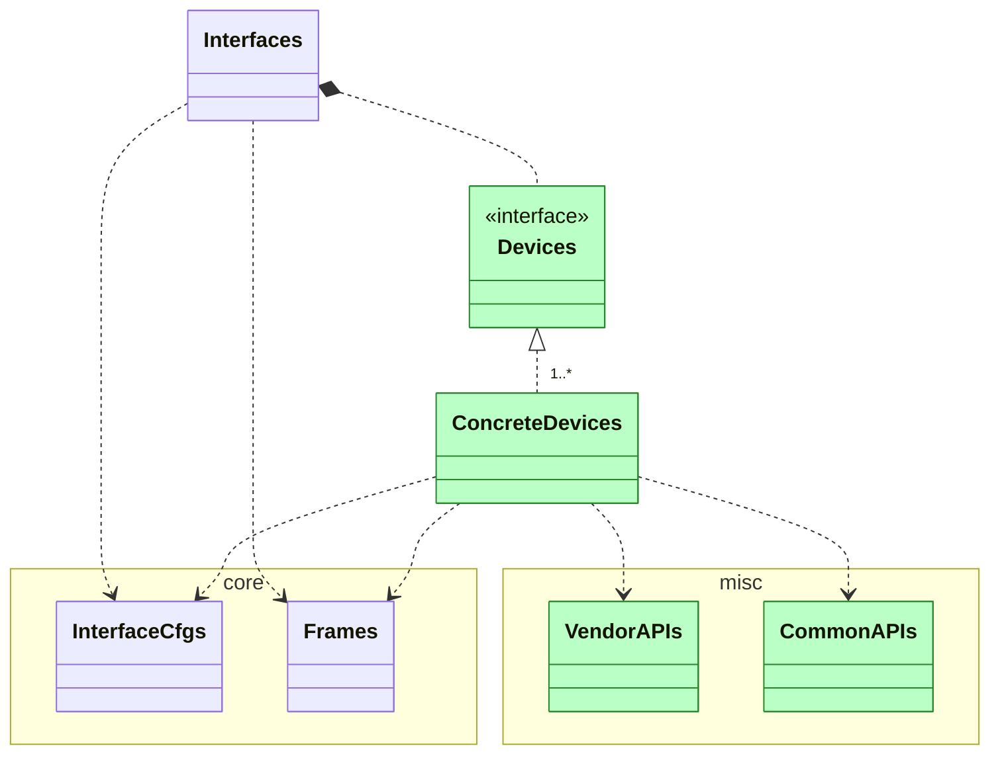

# Internals



## Devices

### Abstract type adn functions

```@docs
CANBus.Interfaces.Devices.AbstractDevice
```


## ConcreteDevices

### Kvaser

```@docs
CANBus.Interfaces.Devices.KvaserDevices
```

```@docs
CANBus.Interfaces.Devices.KvaserDevices.KvaserDevice
```


### slcan

```@docs
CANBus.Interfaces.Devices.SlcanDevices
```

```@docs
CANBus.Interfaces.Devices.SlcanDevices.SlcanDevice
```

### SocketCAN

```@docs
CANBus.Interfaces.Devices.SocketCANDevices
```

```@docs
CANBus.Interfaces.Devices.SocketCANDevices.SocketCANDevice
```

### Vector

```@docs
CANBus.Interfaces.Devices.VectorDevices
```

```@docs
CANBus.Interfaces.Devices.VectorDevices.VectorDevice
```

## VendorAPIs

### Kvaser

```@docs
CANBus.Interfaces.Devices.KvaserDevices.Canlib
```

### slcan

```@docs
CANBus.Interfaces.Devices.SlcanDevices.slcandef
```

### SocketCAN

```@docs
CANBus.Interfaces.Devices.SocketCANDevices.SocketCAN
```

### Vector

```@docs
CANBus.Interfaces.Devices.VectorDevices.Vxlapi
```

## CommonAPIs

### SerialHAL

```@docs
CANBus.misc.SerialHAL
```

### WinWrap

```@docs
CANBus.misc.WinWrap
```

### BitTiming

```@docs
CANBus.misc.BitTiming
```